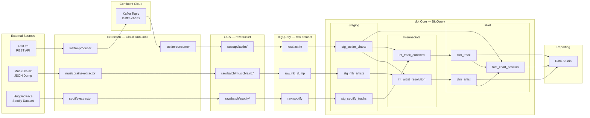
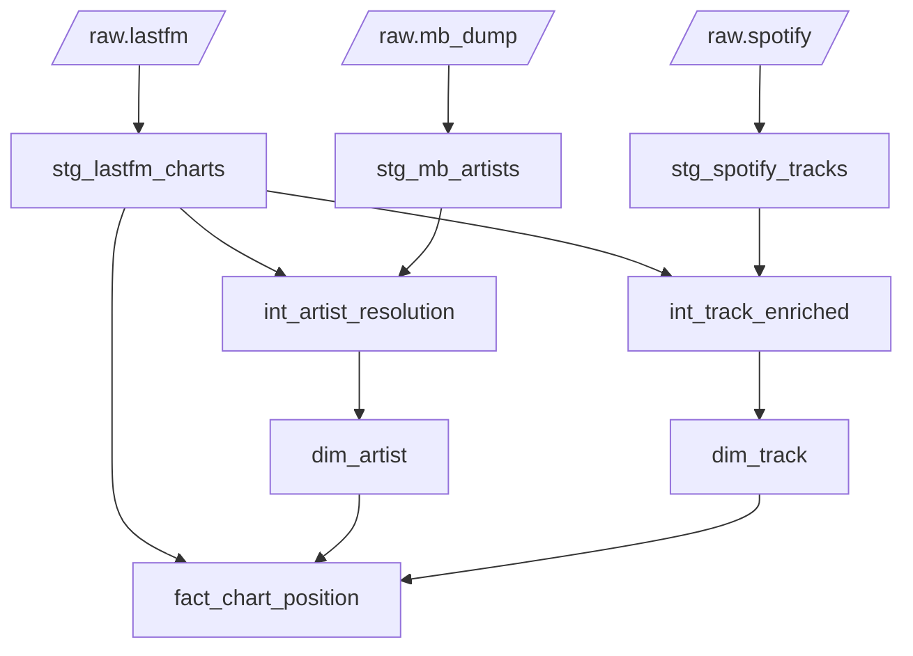
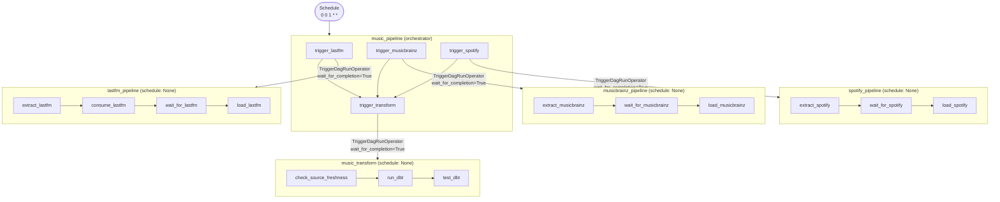

# Technical Design Document — GCP #0001

**Status:** In Development  
**Last updated:** 2026-05-22  
**Author:** David-Bryne Adedeji

---

## 1. Overview

A monthly music intelligence pipeline that ingests chart, artist, and track data from three external sources, unifies them in BigQuery via dbt, and surfaces insights through a Data Studio dashboard. The pipeline runs on the first of each month, orchestrated by Airflow on Astronomer Cloud, with all infrastructure provisioned on GCP via idempotent gcloud CLI scripts.

The central analytical question: **which artists and tracks are dominating charts, and what do we know about them?**

---

## 2. Goals

- Ingest Last.fm weekly chart data, MusicBrainz artist metadata, and a Spotify tracks dataset on a monthly cadence
- Produce a clean dimensional model (`dim_artist`, `dim_track`, `fact_chart_position`) in BigQuery
- Resolve artist identities across sources using MusicBrainz MBID as the canonical key
- Deliver four Data Studio dashboard pages covering chart performance, artist profiles, audio features, and trends

---

## 3. Non-Goals

- Real-time or sub-daily data freshness
- Track audio feature analysis beyond what the Spotify dataset provides
- User-level listening history (aggregate chart data only)

---

## 4. Stack

| Layer | Technology |
|:---|:---|
| Extraction | Cloud Run Jobs, Python 3.12, Pydantic |
| Messaging | Apache Kafka — Confluent Cloud |
| Storage | Google Cloud Storage |
| Warehousing | Google BigQuery |
| Transformation | dbt Core + dbt-utils |
| Orchestration | Astronomer Cloud (managed Airflow 3.2.1) |
| Reporting | Data Studio |
| IaC | gcloud CLI (Shell) |
| CI/CD | GitHub Actions |
| Secrets | GCP Secret Manager |
| Region | `europe-west2` (London) |

---

## 5. Architecture

### 5.1 High-level diagram



---

### 5.2 Data sources

| Source | Type | Cadence | Volume |
|:---|:---|:---|:---|
| Last.fm `chart.getTopArtists` | REST API | Monthly run, paginated | ~50 artists/page, all pages |
| MusicBrainz artist dump | Batch download (`artist.tar.xz`) | Monthly | ~2M artist records, 2 GB compressed |
| Spotify tracks dataset | HuggingFace Parquet | Monthly snapshot | ~114k tracks, 13.6 MB |

---

### 5.3 Extraction layer

Four Cloud Run Jobs — stateless, run to completion, scale to zero.

**`lastfm-producer`**

Paginates `chart.getTopArtists` at 0.2 s per page (5 req/s limit). Each artist is validated as an `ArtistChart` Pydantic record and produced to the `lastfm.charts` Kafka topic. Publishes each page to Kafka immediately before fetching the next — a Cloud Run retry on page N only replays from page N, not from the beginning.

**`lastfm-consumer`**

Drains the `lastfm.charts` topic using a 30-second silence window. Stamps a single `_ingested_at` UTC timestamp across all records in the batch. Kafka offsets are committed only after a successful GCS write — failed writes can be replayed by re-running the job. Malformed messages are routed to a dead-letter path rather than skipped silently.

**`musicbrainz-extractor`**

Resolves the latest dump version via the `LATEST` file, streams `artist.tar.xz` in 8 MB chunks computing SHA256 in parallel, verifies the checksum, then stream-extracts from the XZ tarball. Only nine fields are retained; hyphenated MusicBrainz keys normalised to snake_case, `life-span` flattened, genres reduced to a name list.

**`spotify-extractor`**

Downloads the auto-generated Parquet export from HuggingFace (`refs/convert/parquet` revision), drops the serialised DataFrame index column, stamps `_ingested_at`, and stages to GCS.

---

### 5.4 Storage layout

```
gs://<bucket>/
  raw/
    api/
      lastfm/          {chart_week}.ndjson   — one file per consumer run
    batch/
      musicbrainz/     mb_artists.ndjson     — filtered artist dump
      spotify/         spotify_tracks.parquet
```

---

### 5.5 BigQuery

| Dataset | Tables | Purpose |
|:---|:---|:---|
| `raw` | `lastfm`, `mb_dump`, `spotify` | GCS load targets — schema defined in `dags/schemas/*.json` |
| `music` | dbt mart models | Dimensional models consumed by reporting |

Table schemas are a single source of truth shared between the Airflow DAGs (`GCSToBigQueryOperator`) and the infrastructure provisioning scripts (`bigquery.sh`).

---

## 6. dbt Model Lineage



### Model notes

**Staging**

- `stg_lastfm_charts` — casts types, generates `chart_key` surrogate on `artist_name + chart_week`, deduplicates on `(artist_name, chart_week)` keeping the most recently ingested record
- `stg_mb_artists` — maps dump fields; parses `begin_date`/`end_date` strings via `safe.parse_date`; `artist_type` validated with `accepted_values`
- `stg_spotify_tracks` — range tests on all 0–1 audio features, `popularity` 0–100, `key` 0–11, `mode` accepted_values [0, 1]

**Intermediate**

- `int_artist_resolution` — MBID join is the primary resolution path. For artists without an MBID, a second left join on `lower(regexp_replace(trim(name), r'[^a-z0-9 ]', ''))` fires as a fallback. `qualify row_number()` deduplicates cases where a single normalised name maps to multiple MusicBrainz records. `is_mb_verified` distinguishes both paths.
- `int_track_enriched` — joins Spotify tracks to Last.fm charting artists via `INSTR(lower(artists), name_key) > 0`. One row per Spotify track per matched chart artist; `dim_track` deduplicates on `track_id`.

**Mart**

- `dim_artist` — one row per artist, MBID as natural key, surrogate `artist_key`
- `dim_track` — one row per `track_id`, full Spotify audio feature set; deduplicates on `track_id` taking the highest-popularity row
- `fact_chart_position` — one row per artist × chart week; grain is artist × `chart_week`

---

## 7. Orchestration

Five DAGs on Astronomer Cloud. `music_pipeline` is the only scheduled DAG; the rest run on trigger only, preventing race conditions and unintended runs.



Each `TriggerDagRunOperator` uses `wait_for_completion=True` — the orchestrator blocks on each sub-DAG and only advances when it succeeds. A failure in one source does not affect the others and can be restarted in isolation.

---

## 8. Infrastructure

All GCP resources are provisioned by idempotent shell scripts that check for resource existence before creating. Scripts source shared configuration from a single `config.env` file and run automatically via GitHub Actions on every merge to `main`.

Scripts prefixed with `_` are manual-only — they require owner-level credentials and are never called by CI. This convention covers Workload Identity Federation setup and project-level IAM bindings.

| Resource | Details |
|:---|:---|
| GCS bucket | Uniform bucket-level access; 90-day lifecycle rule on `raw/` objects |
| BigQuery | `raw` and `music` datasets; raw tables created from schema definitions in `dags/schemas/` |
| Artifact Registry | Docker repository for all Cloud Run Job images |
| Cloud Run Jobs | Five jobs — four extractors + dbt-runner; per-job CPU and memory configuration |
| Secret Manager | API keys and Kafka credentials injected at Cloud Run Job startup |

---

## 9. Security

- All credentials stored in GCP Secret Manager — never in source code or Docker images
- All Docker images run as a non-root system user (UID 1000)
- GitHub Actions uses Workload Identity Federation (OIDC) — no long-lived JSON keys in repository secrets
- Each service account holds only the roles required for its specific operations
- CI holds provisioning roles only; project-level IAM for pipeline SAs is managed manually

---

## 10. CI/CD

Three workflow files chain via `workflow_run`:

```
Validate ──(main, on success)──► Infrastructure ──(on success)──► Deploy
```

| Workflow | Jobs |
|:---|:---|
| `validate.yml` | DAG syntax check, dbt parse, pytest ×4, Docker build ×5 |
| `infra.yml` | GCP provisioning — APIs, storage, BigQuery, registry, secrets, IAM |
| `deploy.yml` | Docker push ×5, Cloud Run Job update, Astronomer image + DAG deploy |

Path filters ensure only changed components re-run on each push. Manual dispatch bypasses all filters and runs the full chain.

---

## 11. Alerting

Pipeline failures trigger a structured log entry to Cloud Logging and an HTML email alert via Airflow's SMTP backend. Three failure classes are distinguished:

| Task | Log prefix | Meaning |
|:---|:---|:---|
| `check_source_freshness` | `STALE SOURCE DATA` | Raw tables not loaded within freshness threshold |
| `test_dbt` | `DATA QUALITY FAILURE` | dbt tests failed |
| Any other task | `PIPELINE FAILURE` | Infrastructure or extraction error |
